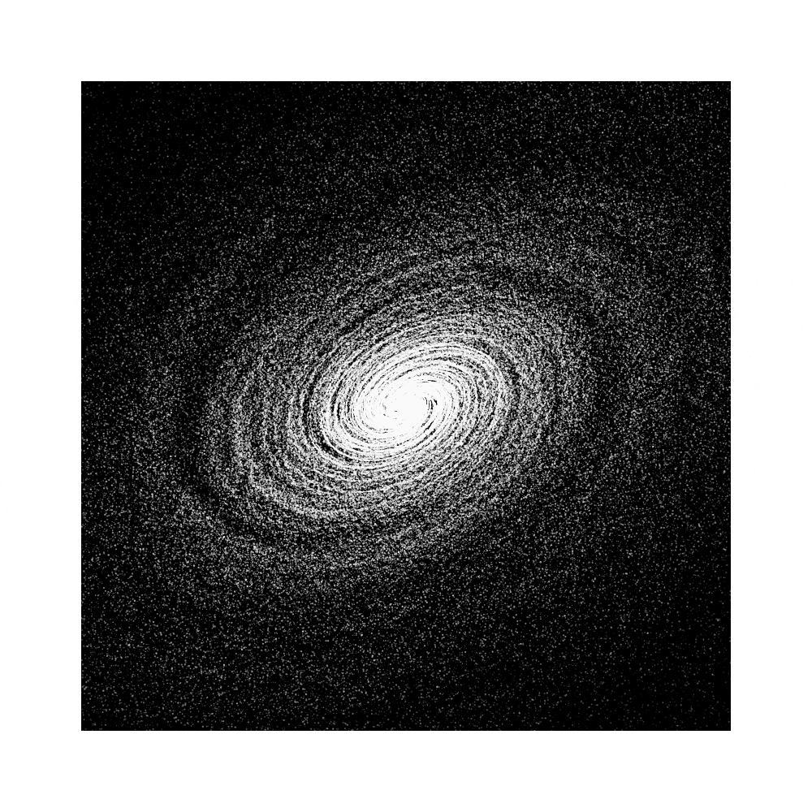
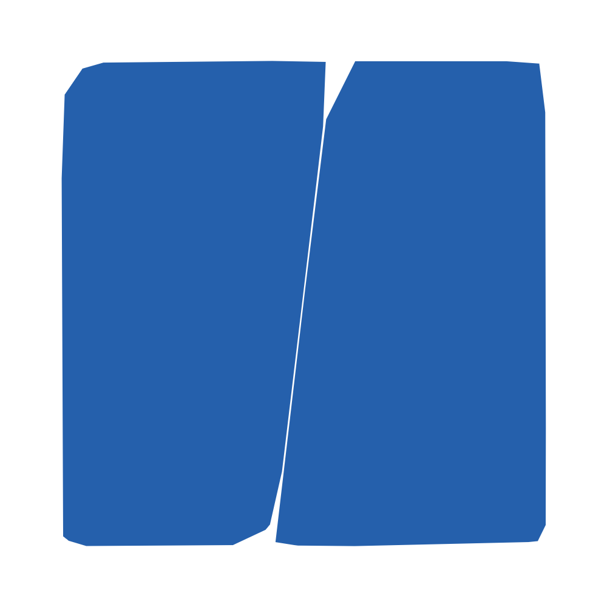
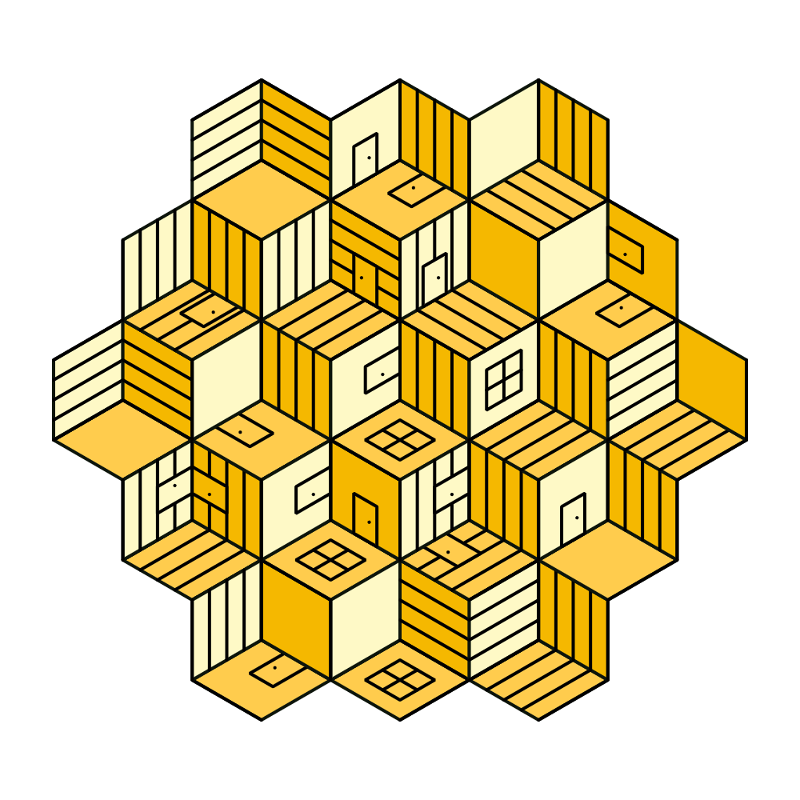
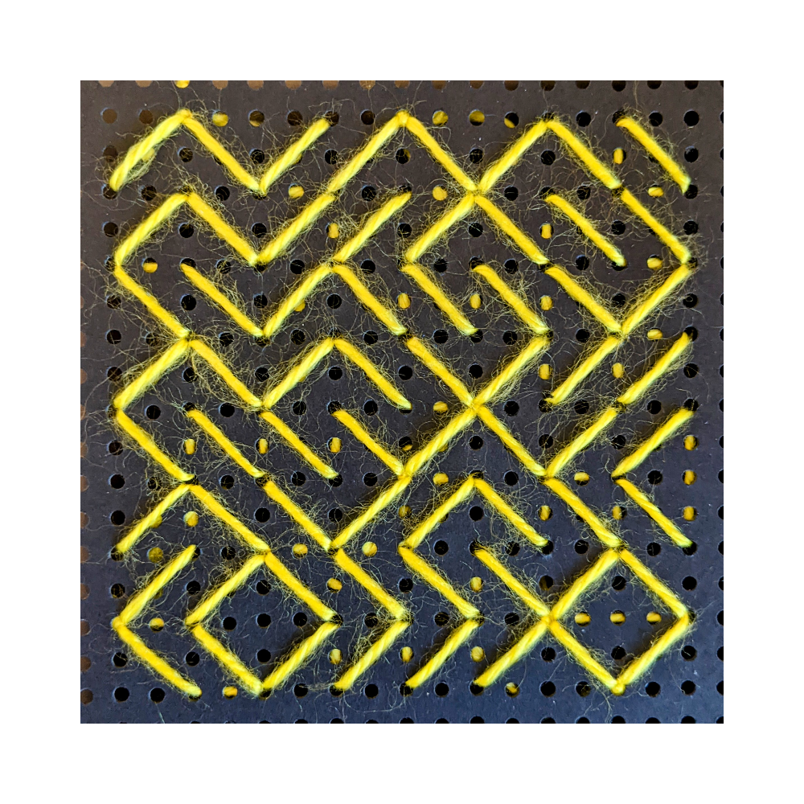

# Genuary 2022

### JAN.1
> Draw 10,000 of something.

   

### JAN.2
> Dithering.

   

### JAN.3
> Space.

   

### JAN.4
> The next next Fidenza.

   

### JAN.5
> Destroy a square.

   

### JAN.6
> Trade styles with a friend.

   

### JAN.7
> Sol LeWitt Wall Drawing.

   

### JAN.8
> Single curve only.

   

### JAN.9
> Architecture.

   

### JAN.10
> Machine learning, wrong answers only.

   

### JAN.11
> No computer.

   

### JAN.12
> Packing (squares, circles, any shape…)

### JAN.13
> 80x800.

### JAN.14
> Something you’d never make.

### JAN.15
> Sand.

### JAN.16
> Color gradients gone wrong.

### JAN.17
> 3 colors.

### JAN.18
> VHS.

### JAN.19
> Use text/typography.

### JAN.20
> Make a sea of shapes.

### JAN.21
> Combine two (or more) of your pieces from previous days to make a new piece.

### JAN.22
> Make something that will look completely different in a year.

### JAN.23
> Abstract vegetation.

### JAN.24
> Create your own pseudo-random number generator and visually check the results.

### JAN.25
> Perspective.

### JAN.26
> Airport carpet.

### JAN.27
> #2E294E #541388 #F1E9DA #FFD400 #D90368

### JAN.28
> Self portrait.

### JAN.29
> Isometric perspective.

### JAN.30
> Organic looking output using only rectangular shapes.

### JAN.31
> Negative space.
